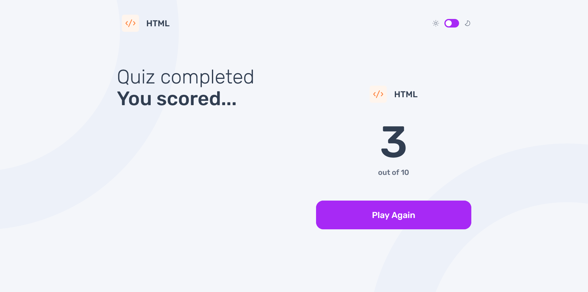

# Frontend Mentor - Frontend quiz app solution

This is a solution to the [Frontend quiz app challenge on Frontend Mentor](https://www.frontendmentor.io/challenges/frontend-quiz-app-BE7xkzXQnU). Frontend Mentor challenges help you improve your coding skills by building realistic projects. 

## Table of contents

- [Overview](#overview)
  - [The challenge](#the-challenge)
  - [Screenshot](#screenshot)
  - [Links](#links)
- [My process](#my-process)
  - [Built with](#built-with)
  - [What I learned](#what-i-learned)
  - [Continued development](#continued-development)
  - [Useful resources](#useful-resources)
- [Author](#author)

**Note: Delete this note and update the table of contents based on what sections you keep.**

## Overview

This project is an interactive quiz application. It allows the user to select a subject and take its quiz content. During the quiz, the user can select an answer from the options and click submit. The user will be required to select an answer before clicking submit. Upon submission, the user will see if his answer is correct or wrong. They can then move on to the next question and do the same process. Upon completing the quiz, the user will be presented with the result of their quiz and they have the option to play again and select another subject and take another quiz.

### The challenge

Users should be able to:

- Select a quiz subject
- Select a single answer from each question from a choice of four
- See an error message when trying to submit an answer without making a selection
- See if they have made a correct or incorrect choice when they submit an answer
- Move on to the next question after seeing the question result
- See a completed state with the score after the final question
- Play again to choose another subject
- View the optimal layout for the interface depending on their device's screen size
- See hover and focus states for all interactive elements on the page
- Navigate the entire app only using their keyboard
- **Bonus**: Change the app's theme between light and dark

### Screenshot

**Light Mode**


**Dark Mode**


**Selected Answer**


**Correct Answer**


**Wrong Answer**


**Error**


**View Score Page**


### Links

- Solution URL: [https://www.frontendmentor.io/solutions/interactive-frontend-quiz-app-using-react-with-sass-uyWrwfVgfs](https://www.frontendmentor.io/solutions/interactive-frontend-quiz-app-using-react-with-sass-uyWrwfVgfs)
- Live Site URL: [https://frontend-quiz-app-virid.vercel.app/](https://frontend-quiz-app-virid.vercel.app/)

## My process

1. I checked the initial files of this project I downloaded from Frontend Mentor website in order to see the contents of it specially the assets that I need for this project.
2. I downloaded the Figma file of this project and view the design. I checked for the design system which contains fonts, colors, spacings and the reusable components. I also checked what are the necessary pages and components states I need to implement. I played with the design's active simulator to know how the components in the design interacts with each other.
3. I then started to create a React application and implemented my folder structure.
4. I then created a Github repository for this project and setup the deployment server for this project using Vercel.
5. I then copied the link to the font I needed from the Google fonts website and pasted it in the HTML. I also created variables for the fonts, colors, spacings that I needed. I setup my CSS reset, typography, and some basic styling the I need.
6. I started creating the components which are the building blocks of the application and then style them after writing its html structure. I started with building the small components like the buttons all the way up to bigger components like the pages and the layout.
7. After building the static version of the application, I then started to implement some logic of the application using React features such as states, props and React's way of fetching data to retrieve the data from a json file in my codebase.
8. I tested the application and made sure the application functions the way it needs to and debug along the way.
9. I started implementing the changing of theme from light mode to dark mode and vice versa which is the bonus feature for this project.
10. I did some refactoring and minor bug fixes to polish my solution.

### Built with

- React JSX
- CSS custom properties
- Flexbox
- Mobile-first workflow
- [React](https://react.dev/) - JS library
- [Vite](https://vite.dev/) - Build Tool
- [Sass](https://sass-lang.com/) - CSS Preprocessor

### What I learned

By building this project using React, I was able to practice creating reusable components that I can use and combine them together to build the entire application. I learned how to use some of React features such as state and props to build the logic of the application.

**Component**
```js
export default function Subject({ children, imageSrc, onSubjectClick }) {
  return (
    <button className="subject" onClick={onSubjectClick}>
      
      <h2 className="subject__title">{children}</h2>
    </button>
  );
}
```

**State and Props**
```js
import { useState, useEffect } from "react"

export default function ThemeToggle() {
    const [theme, setTheme] = useState(localStorage.getItem('theme') || 'light');

    useEffect(() => {
        document.documentElement.setAttribute('data-theme', theme);
        localStorage.setItem('theme', theme);
    }, [theme]);

    const toggleTheme = () => {
        setTheme(prevTheme => (prevTheme === 'light' ? 'dark' : 'light'));
    };

    return (
        <div className="toggle-container">
            {/*  */}
            <span className="sun"></span>
            <label className="switch">
                <input type="checkbox" onChange={toggleTheme} />
                <span className="slider round"></span>
            </label>
            <span className="moon"></span>
            {/*  */}
        </div>
    )
}
```

### Continued development

I will learn more about react. I will learn its features and the best practices in using it. By mastering this library, I will be able to build complex and more robust applications in the future.

### Useful resources

- [React](https://react.dev/) - This is a nice documentation for learning react. It has interactive exercises as well to solidify your learning.
- [Vite](https://vite.dev/) - This is a good resource if you want to setup a pure react application. A nice build tool to use if you want to learn the core react features only.
- [Sass](https://sass-lang.com/) - This is a good resource if you are using Sass for styling. It has some nice features as well that allows you to organize your style files and write better code.
- [BEM](https://getbem.com/) - This is a good resource to learn how to name your classes for better readability and maintainability.

## Author

- Website - [Schindler Dumagat](https://schindlerdumagat.github.io/webportfolio/)
- Frontend Mentor - [@schindlerdumagat](https://www.frontendmentor.io/profile/schindlerdumagat)
- LinkedIn - [@schindler-dumagat](https://www.linkedin.com/in/schindler-dumagat-015238230/)
